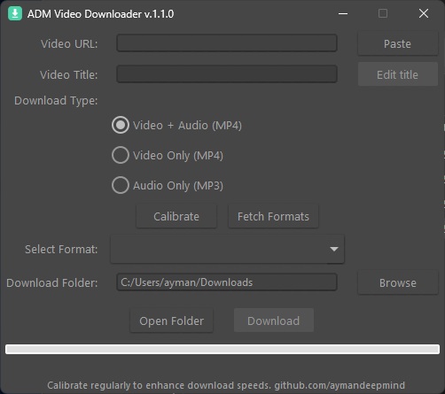

# ADM Video Downloader

A powerful, cross-platform video downloader application that allows you to download videos and audio from various online platforms with customizable quality options.



## Features

- **Multiple Download Types**:
  - Video + Audio (MP4)
  - Video Only (MP4)
  - Audio Only (MP3)
- **Quality Selection**: Choose from various resolution and bitrate options
- **Custom Titles**: Edit video titles before downloading
- **User-Friendly Interface**: Clean, themed UI with progress tracking
- **Persistent Settings**: Remembers your download folder location
- **Built-in FFmpeg**: Bundled with FFmpeg for media conversion
- **Cross-Platform**: Works on Windows, macOS, and Linux

## Installation

### Option 1: Download Binary (For common users)

**[⬇️ Download Latest Release (v1.0.0)](https://github.com/aymandeepmind/video-downloader/releases/download/v1.0.0/master.zip)**

1. Go to the [Releases](https://github.com/aymandeepmind/video-downloader/releases) page
2. Download the latest version for your platform
3. Extract the downloaded file
4. Run the executable (`ADM Video Downloader.exe` on Windows)

### Option 2: Run from Source (Mainly for developers)

1. Clone this repository:
   ```
   git clone https://github.com/aymandeepmind/video-downloader.git
   cd video-downloader
   ```

2. Install the required dependencies:
   ```
   pip install -r requirements.txt
   ```

3. Run the application:
   ```
   python src/main.py
   ```

## Usage

1. **Paste URL**: Copy the video URL and click "Paste"
2. **Edit Title** (Optional): Click "Edit title" to customize the filename
3. **Select Download Type**: Choose between Video+Audio, Video Only, or Audio Only
4. **Fetch Formats**: Click "Fetch Formats" to retrieve available quality options
5. **Select Format**: Choose your preferred quality/resolution
6. **Choose Download Location**: Select a folder to save the download
7. **Download**: Click "Download" to start the download process

## Dependencies

- Python 3.6+
- yt-dlp
- tkinter
- ttkthemes
- FFmpeg (bundled)

## Building from Source

To create a standalone executable:

```
pip install pyinstaller
pyinstaller --onedir --windowed --icon=assets/icon.ico --add-data "assets/ffmpeg;assets/ffmpeg" --add-data "assets/icon.ico;assets" src/main.py
```

## License

This project is licensed under the MIT License - see the [LICENSE](LICENSE) file for details.

## Contributing

Contributions are welcome! Please feel free to submit a Pull Request.

## Contact

GitHub: [aymandeepmind](https://github.com/aymandeepmind)

## Acknowledgments

- [yt-dlp](https://github.com/yt-dlp/yt-dlp) - The core downloading engine
- [FFmpeg](https://ffmpeg.org/) - For media processing
- [ttkthemes](https://github.com/TkinterEP/ttkthemes) - For the UI theme 